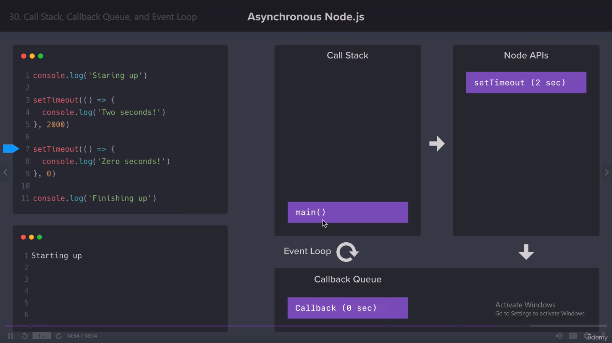

### Why asynchronous programming?
> In computer programming, asynchronous operation means that a process operates independently of other processes, whereas synchronous operation means that the process runs only as a result of some other process being completed or handed off.
### How does asynchronous code behavious?
> The Programm execuation doesn't stop for asynchronous task even for 0 seconds to complete and continue execuation the synchronous task 
### How to initialize NPM with default Settings
> * *npm init -y*
> * This Option will not ask any question and set the project as default settings
```javascript
l = console.log;
l('Start')
setTimeout(() => {
  l('2 second pause')
}, 2000)
setTimeout(() => {
  l('0 second pause')
}, 0)
l('End')
```
#### Result of the Above Code
> * Start
> * End
> * 0 second pause
> * 2 second pause

#### What are Call Stack, Callback Queue, and Event Loop?
> Image is Attach to Understand the example


#### How to Make HTTP Request using NPM 'Request' module
> 1. Error, Response, Body are Javascript Object
> 2. But Inside them The data is in the form of JSON
> 3. We have to manually convert them to process
> 4. By using JSON.parse

##### Request is Deperecated
> * *npm i request*
```javascript
// Example of NPM package Request
request({url: wheather.new_york_weather}, (error, response, body) => {
  console.warn('REQUEST');
  console.log('ERROR :', error); 
  console.log('STATUS CODE :', response && response.statusCode); 
  // Request is not converting JSON into javascript object
  const data  = JSON.parse(body)
  console.log('BODY:', data.current);
}) 
```
##### Postman Request is the Latest for making HTTP Request
> * *npm i postman-request*
```javascript
postman_request({url: wheather.new_york_weather}, (error, response, body) => {
  console.warn('POSTMAN REQUEST');
  console.log('ERROR :', error); 
  console.log('STATUS CODE:', response && response.statusCode); 
  const data  = JSON.parse(body)
  console.log('BODY:', data.current);
}) 
```
